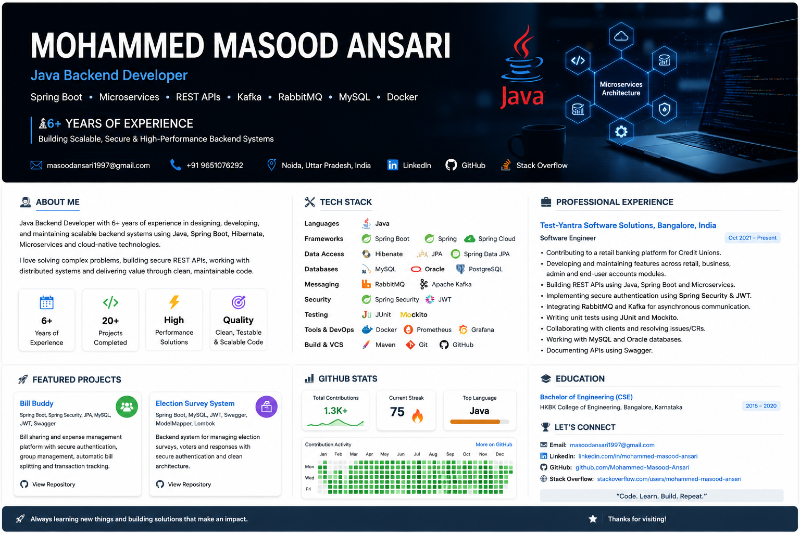

  

About Me
💻 6+ years of experience in Java Backend Development
☕ Strong experience with Java, JEE, Spring Boot and Spring Framework
🏗️ Experienced in developing Monolithic and Microservices-based applications
🔐 Experienced with Spring Security and JWT authentication
🌐 Experienced in designing and developing RESTful APIs
🗄️ Hands-on experience with MySQL, Oracle and PostgreSQL
🔄 Experienced with Hibernate, JPA and Spring Data JPA
📨 Worked with RabbitMQ and Apache Kafka for asynchronous communication
🧪 Experienced in JUnit and Mockito for unit testing
📚 API documentation using Swagger / OpenAPI
🐳 Familiar with Docker
📊 Familiar with Prometheus and Grafana
🤖 Exploring AI-assisted development and Prompt Engineering
🌱 Continuously learning Cloud, DevOps and modern backend architecture
🛠️ Tech Stack
☕ Programming Language
🚀 Backend & Frameworks
🏗️ Architecture
Microservices Architecture
Monolithic Architecture
RESTful API Design
Event-Driven Architecture
Design Patterns
Secure Backend Architecture
🔐 Security
Spring Security
JWT Authentication
Role-Based Access Control
Authentication & Authorization
📨 Messaging & Streaming
RabbitMQ
Apache Kafka
Asynchronous Communication
Event-Driven Microservices
🗄️ Databases
🔎 Query Languages
SQL
JPQL
HQL
🧪 Testing
JUnit
Mockito
Unit Testing
Integration Testing
📖 API Documentation
REST APIs
Swagger
OpenAPI
🐳 DevOps & Monitoring
Docker
Prometheus
Grafana
🔧 Development Tools
IntelliJ IDEA
Eclipse EE
Spring Tool Suite
VS Code
Postman
MySQL Workbench
SQL Developer
pgAdmin
📦 Build & Version Control
Maven
Git
GitHub
🤖 AI & Productivity
Prompt Engineering
GitHub Copilot
ChatGPT
AI-Assisted Development
💼 Professional Experience
🏢 Test-Yantra Software Solutions
Software Engineer | Java Backend Developer

October 2021 – Present

Worked on a comprehensive retail banking platform for Credit Unions, contributing to secure and scalable backend services across multiple modules.

Key Contributions
Developed and enhanced backend services using Java, Spring Boot, Hibernate and Microservices
Worked across retail, business, admin and end-user account modules
Designed and maintained RESTful APIs
Documented APIs using Swagger
Implemented asynchronous communication using RabbitMQ and Apache Kafka
Worked with event-driven microservices
Collaborated with clients to understand requirements and implement change requests
Investigated and resolved application issues
Developed unit tests using JUnit
Supported integration and system-level testing
Worked with relational databases including MySQL and Oracle
🚀 Featured Projects
🧾 Bill Buddy
Bill Sharing & Expense Management Backend
Spring Boot | Spring Security | JPA | MySQL | JWT | Swagger
A RESTful backend application designed to help users manage personal and group expenses.
Features
👤 User registration and authentication
🔐 JWT-based authentication
🛡️ Role-Based Access Control
👥 Group expense management
💰 Automatic bill splitting
📊 Transaction tracking
🗄️ Spring Data JPA persistence
📖 Swagger API documentation
🗳️ Election Survey System
Election Survey Management Backend
Spring Boot | MySQL | JWT | Swagger | ModelMapper | Lombok
A backend application for creating and managing election surveys, voters and survey responses.
Features
📝 Create and manage surveys
👥 Manage voters
📊 Track survey responses
🔐 JWT authentication
📖 Swagger API documentation
🏗️ Clean architecture
🔄 ModelMapper integration
⚡ Lombok for reducing boilerplate code
🏗️ Backend Architecture

My primary area of interest is backend engineering and distributed systems.

                    ┌───────────────────┐
                    │    Client / UI    │
                    └─────────┬─────────┘
                              │
                              ▼
                    ┌───────────────────┐
                    │    REST APIs      │
                    │   Spring Boot     │
                    └─────────┬─────────┘
                              │
                    ┌─────────▼─────────┐
                    │ Spring Security   │
                    │      + JWT        │
                    └─────────┬─────────┘
                              │
             ┌────────────────┼────────────────┐
             │                │                │
             ▼                ▼                ▼
       ┌──────────┐     ┌──────────┐    ┌──────────┐
       │ Service  │     │ Service  │    │ Service  │
       │    A     │     │    B     │    │    C     │
       └────┬─────┘     └────┬─────┘    └────┬─────┘
            │                │                │
            └────────────────┼────────────────┘
                             │
                  ┌──────────▼──────────┐
                  │ RabbitMQ / Kafka     │
                  │ Async Communication  │
                  └──────────┬──────────┘
                             │
                  ┌──────────▼──────────┐
                  │     Database        │
                  │ MySQL / Oracle /    │
                  │ PostgreSQL           │
                  └─────────────────────┘
📚 What I Am Currently Exploring

I'm continuously improving my backend engineering skills and expanding toward the broader software engineering ecosystem.

Current Learning Areas
☁️ Cloud Technologies
🐳 Docker & Containerization
⚙️ DevOps & CI/CD
🏗️ System Design
🔄 Distributed Systems
🤖 AI-Assisted Software Development
✍️ Prompt Engineering
🌐 Frontend fundamentals
🎯 My Engineering Interests

I am particularly interested in:

Scalable Backend Systems
Microservices
Distributed Systems
Event-Driven Architecture
REST API Design
Authentication & Authorization
Database Design
Performance Optimization
Clean Code
Design Patterns
Testable & Maintainable Software
🎓 Education
Bachelor of Engineering — Computer Science & Engineering

HKBK College of Engineering, Bangalore, Karnataka

2015 – 2020

I'm always interested in connecting with fellow developers, discussing backend engineering, Java, Spring Boot, Microservices, System Design and new technologies.

📧 Email: masoodansari1997@gmail.com

🔗 LinkedIn: Add your LinkedIn profile here

💻 GitHub: Mohammed-Masood-Ansari
